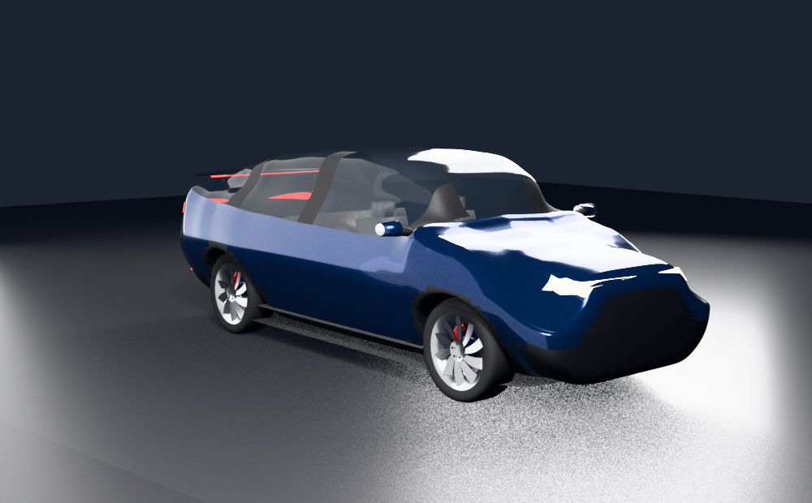
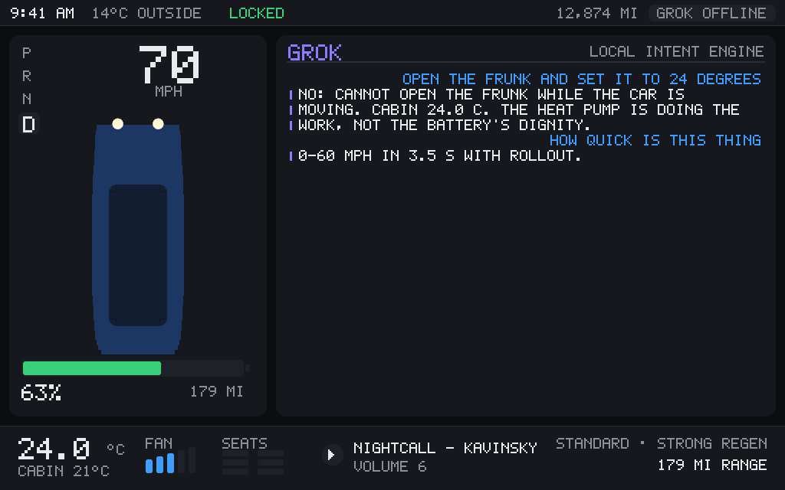
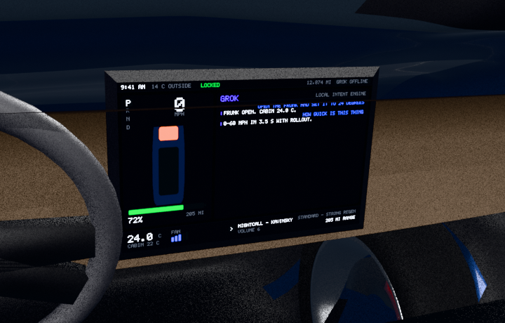

# Tesla Model Y 2023 Performance, in Blender

A digital Model Y Performance built entirely from published specification: the
body is generated from the real dimensions, the drivetrain is simulated against
the real performance figures, the 15-inch touchscreen is a live image rendered
inside Blender, and Grok is wired to the car's controls through xAI function
calling — with a local intent engine that does the same job when there is no
API key.



*Built and rendered in Blender 5.2 — 36 objects, 9,374 polygons, body measured
in-scene at 4749.8 × 1920.1 mm on a 2890.5 mm wheelbase.*

Nothing here is scraped from Tesla's CAD or from any commercial model. Every
number is sourced in [`model_y/specs.py`](model_y/specs.py), and anything Tesla
does not publish is labelled `ESTIMATED` there.

---

## What it actually does

**The car is generated, not modelled.** The body is one lofted surface driven by
keyed silhouette curves (roofline, lower edge, half-width, beltline, greenhouse
width) pinned to the published dimensions, so it measures 4750.7 × 1920.2 ×
1623.1 mm on a 2890.5 mm wheelbase *by construction*. Wheel arches are cut
analytically — the lower edge of each cross-section is clipped up to the arch
circle around the axle — so the topology stays quad-only with no booleans. The
bonnet and tailgate are split out of the same shell into separate objects on
their own hinges, so they open with the shut lines still lining up.

**The computer is real.** `model_y/vehicle_sim.py` is a longitudinal vehicle
model: power and traction limits, drag from the published Cd 0.23, rolling
resistance, regen, HVAC and accessory loads, battery state of charge, and a V3
Supercharger taper. It is checked against the published figures in CI:

| | published | simulated |
|---|---|---|
| 0–60 mph | 3.5 s | 3.45 s |
| 0–100 km/h | 3.7 s | 3.63 s |
| Top speed | 155 mph (limited) | 155 mph |
| 70 mph consumption | — | 265 Wh/mi |
| 10→80 % Supercharging | ~30 min | 28 min |

**The touchscreen is real.** The UI is rasterised in pure Python into a Blender
image datablock and lit as an emissive texture on the 15-inch display — status
bar, car card with live closures and battery, map with the current route,
climate and media bar, and Grok's conversation. A full 1024×640 repaint takes
about 110 ms, so it updates live while the car drives in the viewport, and it
can be baked per-frame so a rendered animation shows the screen changing.



And the same UI, lit inside the car:



**Grok is real.** With `XAI_API_KEY` set (or a key in the add-on preferences),
the assistant talks to the xAI chat-completions API with the car's controls
exposed as function-calling tools; Grok decides what to call, the calls execute
against the live car, and the results go back for the answer. With no key, the
same tools are driven by a local intent parser — including compound requests
like *"open the frunk and set it to 24 degrees"* — so the car is never a dead
prop. Unsafe requests are refused in both paths (no shifting out of Park with a
door open, no opening the boot at speed).

```
> set the temperature to 72F        Cabin 22.0 C.                       [set_climate]
> charge to 80%                     Charging to 80%, about 6 minutes.   [set_charging]
> navigate to the airport           Routing to The Airport, 18.0 miles. [navigate_to]
> how quick is this thing           0-60 mph in 3.5 s with rollout.     [get_specification]
> paint it midnight silver          Done: Midnight Silver Metallic.     [set_paint]
```

---

## Running it

**As a Blender add-on** (Blender 3.6 – 5.x): zip the `model_y` folder and
install it, or drop it in your `scripts/addons` directory and enable *Tesla
Model Y 2023 Performance*. The sidebar (`N` → **Model Y**) has:

* **Vehicle** — paint, interior and studio toggles, Build
* **Drive** — gear, accelerator, brake, steering, a live simulation loop, and a
  "Launch to 60 mph" button that reports the measured time
* **Cabin & Body** — climate, locks, frunk, tailgate, lights, charging
* **Grok** — ask it anything, or tap a suggestion; the reply lands on the
  touchscreen as well as in the panel
* **Touchscreen** — which page to show, save the screen as a PNG, bake a drive
  to keyframes

**Headless:**

```bash
blender --background --python build.py -- --out model_y.blend
blender --background --python build.py -- --paint "Red Multi-Coat" --render hero.png
blender --background --python build.py -- --ask "open the frunk" --screen screen.png
python3 build.py --self-test          # no Blender: spec sheet + simulated performance
```

**One file, no install** — `blender/model_y_standalone.py` is the whole car in a
single dependency-free script for pasting into Blender's text editor or handing
to a remote `bpy` worker. It is a port of the package (same tables, same maths);
the test-suite asserts the two build identical geometry.

**Tests** (plain Python, no Blender, no dependencies):

```bash
python3 tests/run_tests.py      # 29 checks: geometry, dynamics, Grok, add-on
python3 tools/preview.py        # orthographic PNG previews without Blender
```

The add-on group runs the entire Blender layer against `tests/fake_bpy.py`, a
stand-in for `bpy`.

Building it in a real Blender caught three things a fake cannot: children were
double-offset because `matrix_world` is not evaluated for objects created in the
same run (every wheel sat outside its arch); the generated screen image was lost
on save because a generated buffer is not written to the .blend unless it is
packed; and the screen's own bezel was mounted 4 mm in *front* of the display,
hiding it completely. All three are fixed, and the last one now has a test.

---

## Layout

```
model_y/
  specs.py          published figures + sources; the single source of truth
  geom/             pure-Python geometry: body, wheels, lights, interior
  ui/               5x7 bitmap font, software rasteriser, touchscreen layout
  vehicle_sim.py    drivetrain, battery, charging, cabin
  grok.py           xAI client, tool definitions, offline intent engine
  materials.py      version-tolerant Principled materials
  builder.py        geometry -> Blender objects, rig, studio
  rig.py            state -> wheel spin, Ackermann steering, squat, hinges
  screen_driver.py  paints the UI into the Blender image
  props/ops/ui_panel.py   the add-on's controls
blender/model_y_standalone.py   the whole car in one file
tools/              preview renderer, bundler for remote Blender workers
tests/              the suite and the fake bpy
```

## Fidelity, honestly

The exterior is accurate in its **measurements** — overall size, wheelbase,
track, ground clearance, tyre size, mirror width, screen size — and faithful in
proportion and surfacing to the degree a procedural loft can be. It is not a
scan: panel gaps, the exact headlight graphic, door cut-lines, badges and the
finer interior detail are approximations, and the doors do not open (the frunk
and tailgate do). Power, torque split, usable pack capacity and frontal area are
not published by Tesla; the values used are marked `ESTIMATED` in `specs.py` and
were chosen so the simulation reproduces the figures Tesla *does* publish.
