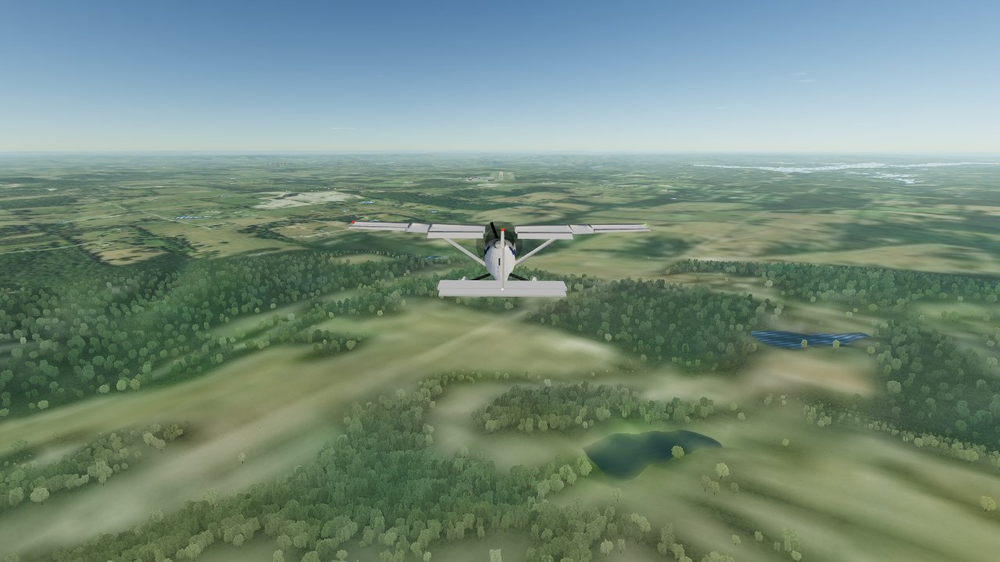
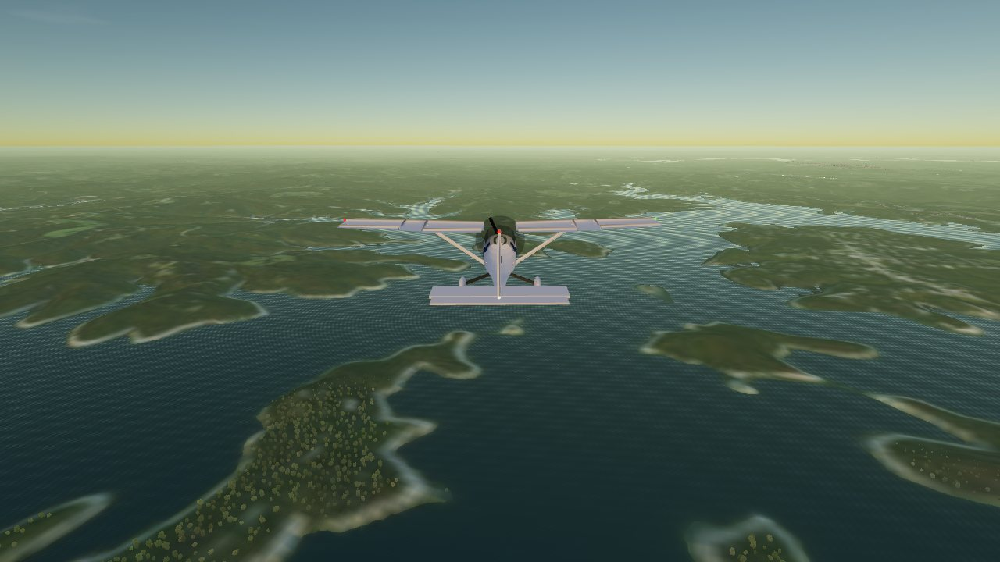
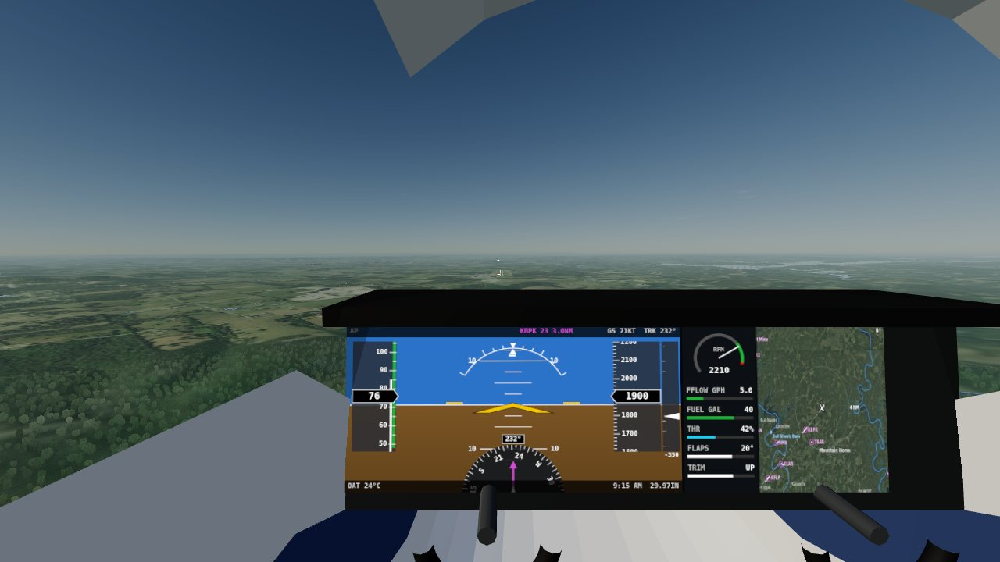
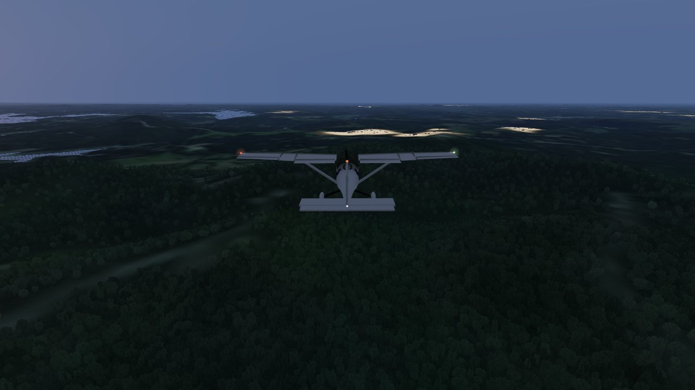

# Twin Lakes

A Cessna 172 flight simulator over the Twin Lakes of north Arkansas. The hills are USGS elevation, the ground
is USGS aerial photography, the lakes, rivers, runways and buildings are OpenStreetMap, and the airplane is a
six-degree-of-freedom flight model built from published Cessna 172 aerodynamics. You take off from Baxter County
Regional (KBPK) in Mountain Home and fly over Norfork Lake, Bull Shoals Lake and the White River.

- **Fly it:** https://claude.ai/artifact/KgkoNhsvPsTeeKxva94zw6 (runs in Chrome, Edge, Safari or Firefox with WebGL2)
- **Locally:** `npm run serve`, then open http://localhost:8084/. Or `npm run build -- --offline` and double-click
  `dist/twin-lakes-offline.html` (one 16 MB file, no server).
- **Verify:** `npm test` runs 18 tests, including two complete flights (takeoff, both dams, landing) on the real
  terrain, one of them in an 11-knot crosswind.



## The world is real

| | Source | Resolution |
|---|---|---|
| Terrain | USGS 3DEP elevation via AWS Terrain Tiles | 8 m around KBPK and Mountain Home, 32 m over 65 x 49 km, 256 m out to a 131 km horizon |
| Ground | USGS National Map orthoimagery (public domain) | 4 m, 16 m, 64 m on the same three grids, tone-matched across acquisition seams |
| Lakes | OpenStreetMap relations for Norfork Lake and Bull Shoals Lake, plus 264 ponds | shoreline as a signed-distance field |
| Rivers | White River and North Fork River from OpenStreetMap, water surface sloping with the valley | |
| Runways | 12 runways from OpenStreetMap: KBPK, Marion County (Flippin), Gaston's grass strip, and more | runway surfaces flattened into the terrain |
| Buildings | 3,662 OpenStreetMap footprints, extruded on the terrain | |
| Sun | NOAA solar position for the real date and time in Mountain Home (Central time) | |
| Weather | Live wind, temperature, pressure, cloud and visibility at KBPK from Open-Meteo when reachable | |

Details that fall out of real data: KBPK's runway comes out 5,017 ft long on a true heading of 231.7°, with a
field elevation of 915 ft (published: 5,001 ft and 928 ft). The water level of Bull Shoals Lake, measured from the
elevation model, is 654 ft, which is its normal pool. The pale "bathtub ring" around the lakes in the imagery is the
real exposed limestone shoreline.



## The airplane is real

The flight model integrates forces and moments on a rigid body at 240 Hz (`src/fdm/aircraft.js`):

| | |
|---|---|
| Aerodynamics | Roskam's Cessna 172 stability derivatives (lift, drag, side force, roll, pitch and yaw moments, rate damping, control power), a lift curve that rounds off and breaks at the stall, flap increments per detent, ground effect on induced drag |
| Propulsion | Lycoming IO-360 torque with altitude lapse, a fixed-pitch propeller with thrust and power coefficients against advance ratio, engine and prop inertia, so RPM rises in a dive and sags in a climb |
| Left-turning tendencies | Engine torque, P-factor and slipstream, with the fin rigged to cancel them at cruise power, and prop wash over the tail so rudder and elevator work during the takeoff roll |
| Ground | Spring-damper gear legs, slip-angle tyre model, spring-link nosewheel steering that hands over to the rudder as speed builds, brakes and parking brake |
| Limits | Stall and spin entry, gear failure on hard landings, prop, wingtip and tail strikes, ditching, structural failure beyond +5.7/-3 g or 1.25 x Vne |

Calibrated against the POH and checked by the test suite:

| Check | POH | Model |
|---|---|---|
| Static RPM, full throttle | 2,300-2,420 | 2,354 |
| Cruise TAS, 8,000 ft, full throttle | 122 kt | 121.9 kt at 2,526 RPM, 9.9 gal/h |
| Climb at Vy near sea level | 730 ft/min at max gross | about 700 ft/min |
| Stall, clean, max gross | 53 KCAS | 51 KIAS |
| Stall, flaps 30, max gross | 48 KCAS | 47 KIAS |

## The demo flight

`npm run headless` flies the whole circuit in Node with the same code the browser uses: the demo pilot takes off
from runway 23, climbs at Vy, navigates to Bull Shoals Dam, down the White River past Cotter, to Norfork Dam, over
Mountain Home, then flies a 3° approach and lands.

| Time | Event | Alt ft | KIAS |
|---|---|---|---|
| 0:20 | Liftoff, 1,219 ft down the runway | 913 | 64 |
| 3:13 | Level at 3,000 ft | 2,902 | 74 |
| 4:03 | Bull Shoals Dam | 3,002 | 94 |
| 7:22 | White River at Cotter | 3,000 | 105 |
| 15:09 | Norfork Dam | 3,000 | 105 |
| 24:51 | Initial approach fix, 9.5 nm out | 2,401 | 91 |
| 27:55 | Glide path captured, flaps 10 | 2,401 | 75 |
| 32:11 | Flare, power to idle | 945 | 62 |
| 32:17 | Touchdown at -95 ft/min, 234 m past the threshold, 1.9 m off the centreline | 910 | 55 |
| 32:46 | Stopped, 0.5 m off the centreline, 4.1 gallons used | 915 | 1 |

In the browser the same pilot flies "Watch it fly" while cinematic cameras cut between chase, flyby, orbit and tower.
Touch any control to take over.

## Scenarios

| | |
|---|---|
| Runway 23, cleared for takeoff | On the numbers at KBPK. The lakes are yours. |
| Short final, runway 23 | Three miles out on a 3° glide path. Follow the PAPI and grease it. Every landing gets graded: sink rate, touchdown point, centreline, crab, bounces. |
| The dam run | Gates at Bull Shoals Dam, the White River at Cotter, Norfork Dam and the US-62 bridge, then home. |
| Engine failure over Norfork Lake | The engine quits at 3,500 ft. Best glide is 68 knots. |
| Lunch at Gaston's | Land on the grass strip beside the White River below Bull Shoals Dam. |
| Watch it fly | The demo flight above. |
| Golden hour over Bull Shoals | Free flight twenty minutes before the real sunset. |



## Controls

| Key | Action |
|---|---|
| W / S or ↑ / ↓ | Pitch (S and ↓ pull the nose up) |
| A / D or ← / → | Roll |
| Q / E | Rudder and nosewheel |
| R / F | Throttle up / down |
| [ / ] | Flaps up / down one notch |
| , / . | Trim nose down / up |
| B, Shift+B | Brakes, parking brake |
| Z | Autopilot on/off (the bar above the instruments has HDG, NAV, ALT, VS and an APR mode that flies the glide path to KBPK 23) |
| C / V | Next camera / cockpit |
| Mouse drag, wheel | Look around, zoom |
| M, I, P, Esc | Map range, hide instruments, pause, menu |

A gamepad works (left stick flies, right stick X is rudder, triggers are throttle, bumpers are flaps), and phones get
an on-screen stick, throttle and flap buttons. Keyboard pilots get two assists, both switchable in the menu:
attitude hold when hands off, and auto-rudder.

## Rendering

- **Terrain:** CDLOD (Strugar 2010). A quadtree of instanced grid patches chosen per frame by distance, with vertices
  morphing to the next coarser grid before each switch, so there are no cracks and no popping from 3 m vertex
  spacing at the runway to the 131 km horizon. The vertex shader samples the three height grids with the exact
  bilinear filtering and blend bands the flight model uses, so the wheels touch the ground that is drawn.
- **Sky:** single-scattering Rayleigh and Mie atmosphere rendered into a look-up table whenever the sun moves,
  shared by the sky dome, the water reflections and the aerial perspective, with twilight and eye adaptation after
  sunset.
- **Water:** real lake levels, band-limited waves, Fresnel reflection of the sky and a sun glitter path.
- **Forest:** trees placed on the GPU around the camera wherever the aerial photo shows canopy.
- **Aircraft:** a procedural 172 with a lofted fuselage and real glass, NACA 2412 wings, moving ailerons, flaps,
  elevator and rudder, a spinning prop, strobes and nav lights, and a cockpit whose panel is the live G1000-style
  display.
- **Airport:** FAA runway markings drawn procedurally, edge and threshold lights, a PAPI that shows two white and
  two red on the glide path, the rotating beacon and a windsock.
- **Instruments:** a G1000-style PFD (attitude, tapes with V-speed arcs, VSI, HSI, autopilot annunciator), an
  engine strip and a moving map drawn from the same imagery.
- **Sound:** all synthesised with Web Audio: engine firing pulses and exhaust, wind, the reed stall horn, tyres and
  the flap motor.



## Files

```
twin-lakes/
  scripts/fetch_data.py     download elevation tiles, imagery tiles and OpenStreetMap data (cached in .cache/)
  scripts/process_data.py   build data/: resample onto local grids, water SDF, lake levels, carve lake beds,
                            flatten runways, tone-match imagery, extract buildings
  data/                     the world: 16-bit PNG heightmaps, JPEG imagery, shoreline SDF PNGs, JSON
  src/fdm/                  flight model, atmosphere, C172 data, autopilot, demo pilot (no DOM, runs in Node)
  src/world/                terrain sampling shared by physics and rendering, PNG heightmap reader
  src/render/               CDLOD terrain and water, sky, scenery, aircraft model, cameras
  src/ui/, src/audio/       PFD, moving map, sound
  src/sim.js, src/main.js   scenarios, weather, landing grading, the app
  test/                     node --test: flight model against the POH, the real-world data, full circuits
  scripts/headless.mjs      the demo flight in Node
  scripts/e2e.mjs           boots the page in headless Chromium and takes screenshots
  scripts/build.mjs         dist/twin-lakes.html (loads data/), the artifact page, and --offline single file
  docs/FLIGHT-MODEL.md      equations and calibration notes
```

Rebuild the world from scratch with `npm run data` (Python 3 with numpy, scipy and pillow; about 4 minutes). The
heightmaps are ordinary 16-bit greyscale PNGs, metres x 32, so they open in Blender or QGIS.

Attribution: elevation from USGS 3DEP via AWS Terrain Tiles; imagery from the USGS National Map (public domain);
map data © OpenStreetMap contributors (ODbL); weather from Open-Meteo. Three.js r160 is vendored (MIT). The
registration N172TL is fictitious. Not for real-world navigation.
